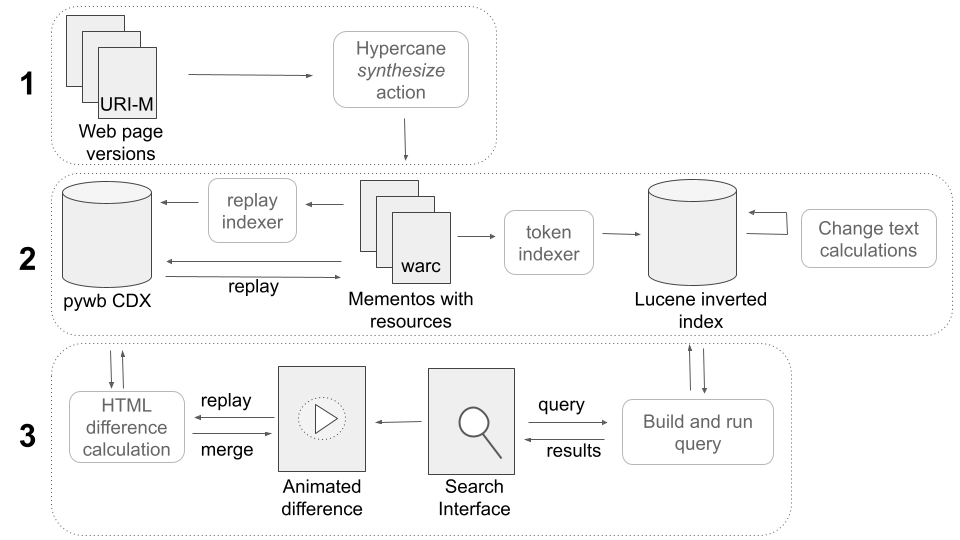

# Making Changes in Webpages Discoverable: A Change-Text Search Interface for Web Archives

Webpages change over time, and web archives hold copies of historical versions of webpages. Users of web archives, such as journalists, want to find and view changes on webpages over time. However, the current search interfaces for web archives do not support this task. For the web archives that include a full-text search feature, multiple versions of the same webpage that match the search query are shown individually without enumerating changes, or are grouped together in a way that hides changes. We present a change text search engine that allows users to find changes in webpages. We describe the implementation of the search engine backend and frontend, including a tool that allows users to view the changes between two webpage versions in context as an animation. We evaluate the search engine with U.S. federal environmental webpages that changed between 2016 and 2020. The change text search results page can clearly show when terms and phrases were added or removed from webpages. The inverted index can also be queried to identify salient and frequently deleted terms in a corpus.

## Overview

This system runs on top of a Solr/SolrWayback instance.



The system is composed of different levels. 
* Level 2 - Lucene change text calculations - in the ```lucene-validity-range``` folder
* Level 2 - Solr indexing configuration - in the ```solr``` folder
* Level 3 - Search interface - in the ```solarium-ui``` folder
* Level 3 - Animated difference - in the ```web-diff-animation``` folder
* Startup scripts with port numbers - in the ```startup-bat``` folder

## Data

* Level 2 - the change text calculations for the 1,000 paired memento EDGI subset (text and json) and the top 100 terms, along with a csv export of all URLs indexed in Solr
* Status code calculations for the 30,000 unpaired mementos in the original EDGI dataset
* Additional data may be located at <a href="https://github.com/phonedude/cs895-f22/tree/main/assignments/frew/week-14-extending-edgi">cs895-f22</a>

## References
Lesley Frew, Michael L. Nelson, and Michele C. Weigle, “Making Changes in Webpages Discoverable: A Change-Text Search Interface for Web Archives,” In Proceedings of ACM/IEEE Joint Conference on Digital Libraries (JCDL). June 2023. Best Student Paper Award. (<a href="https://arxiv.org/abs/2305.00546">arxiv pre-print</a>, <a href="https://docs.google.com/presentation/d/1eqOxDEq87rztVCYx-ywdfoymqYSe6CjuXoPOjo627jE/edit?usp=sharing">slides</a>)

Animation demo blog entries:
* [2023-08-21: Animating Changes in Webpages: Virginia Department of Health](https://ws-dl.blogspot.com/2023/08/2023-08-21-animating-changes-in.html)
* [2023-02-26: Animating Changes in Webpages, Featuring George Santos's Biography](https://ws-dl.blogspot.com/2023/02/2023-02-26-animating-changes-in.html)
